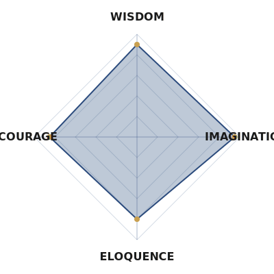

  

 

    

 

<!-- Section Divider -->

  

<h3></h3>

<!-- Main Layout Table -->
<table align="center" width="100%" border="0" cellpadding="0" cellspacing="0">
    <tr>
        <!-- Left Column: Archetype Tree (Skills) -->
        <td width="50%" valign="top">
            <h2 align="center">✦ ARCHETYPE LINEAGE ✦</h2>
            

                <table border="0">
                    <tr>
                        <td>
                            <h3>⚔️ KNIGHT ARCHETYPE</h3>
                            <ul>
                                <li><b>Unlocks:</b> Swift</li>
                                <li><b>Unlocks:</b> SwiftUI</li>
                                <li><b>Unlocks:</b> iOS Development</li>
                            </ul>
                        </td>
                    </tr>
                    <tr>
                        <td>
                            <h3>🔮 MAGE ARCHETYPE</h3>
                            <ul>
                                <li><b>Unlocks:</b> React</li>
                                <li><b>Unlocks:</b> Next.js</li>
                                <li><b>Unlocks:</b> Vercel Ecosystem</li>
                            </ul>
                        </td>
                    </tr>
                    <tr>
                        <td>
                            <h3>🛡️ COMMANDER ARCHETYPE</h3>
                            <ul>
                                <li><b>Unlocks:</b> Node.js</li>
                                <li><b>Unlocks:</b> System Architecture</li>
                                <li><b>Unlocks:</b> Fullstack Deployment</li>
                            </ul>
                        </td>
                    </tr>
                </table>
            

        </td>
        <!-- Right Column: Royal Virtues (Stats) -->
        <td width="50%" valign="top">
             <h2 align="center">✦ ROYAL VIRTUES ✦</h2>
             

                
             

        </td>
    </tr>
</table>

<!-- Section Divider -->

  

<h2 align="center">📜 CURRENT QUESTS</h2>

<table align="center" width="90%">
    <tr>
        <td width="50%" align="center">
            <h3>🐉 LEGENDARY HUNT</h3>
            
            
<b>MONORI</b> <i>The Manga App of Legends</i>

        </td>
        <td width="50%" align="center">
            <h3>👑 ROYAL TRANSFORMATION</h3>
            
            
<b>ANIMELIST</b> <i>Rebranding the classics</i>

        </td>
    </tr>
</table>

 

<!-- GitHub Stats Section -->

    
     
    

 

<!-- Footer Divider -->

  
  
<i>"The throne awaits those who build the path."</i>

